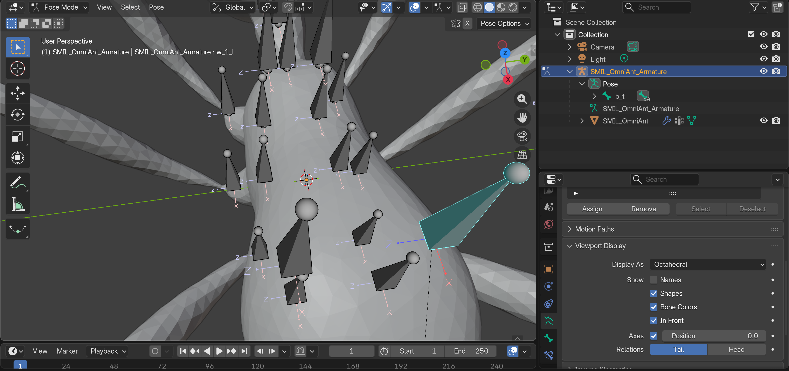
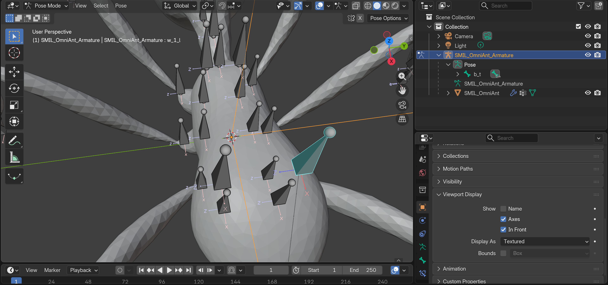
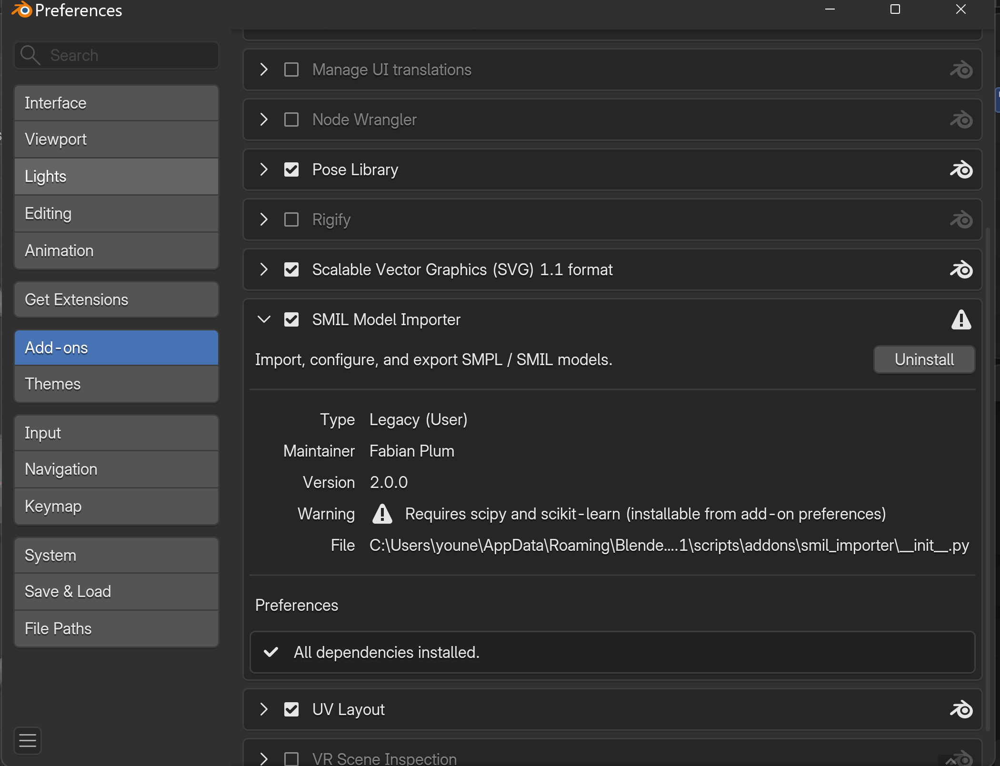
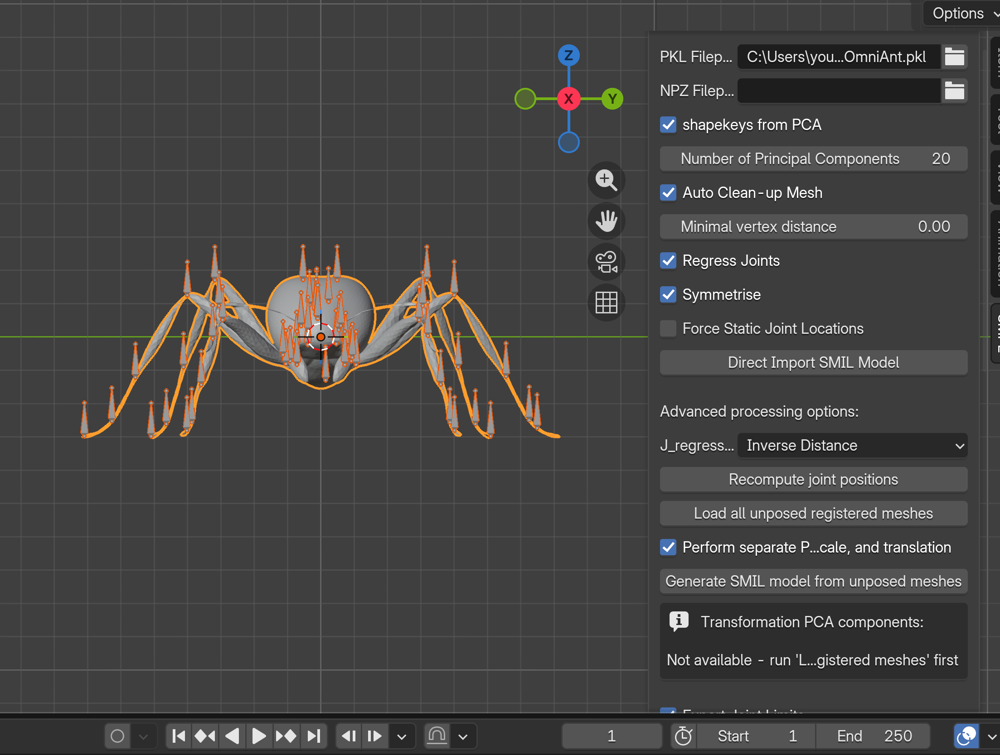
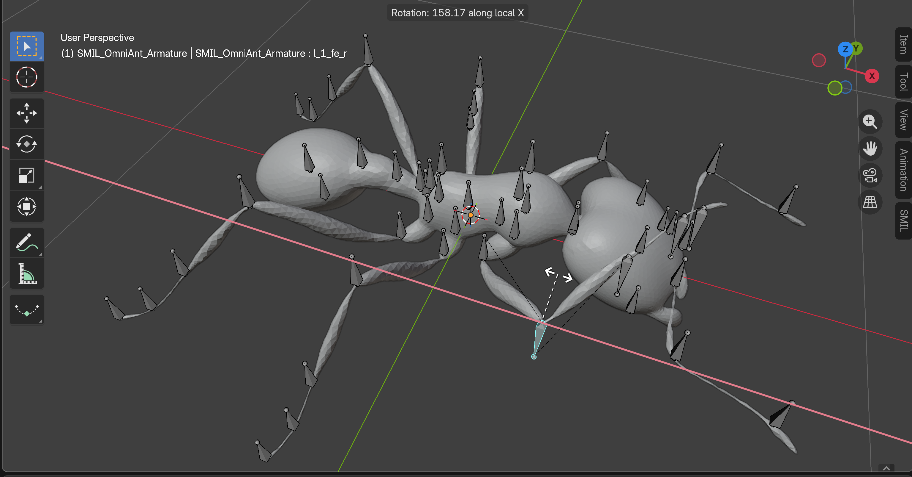
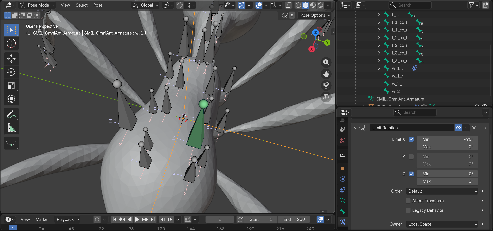
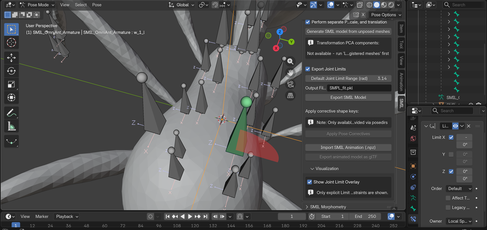
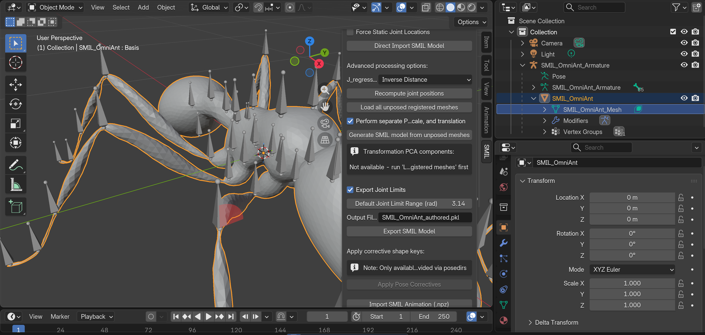
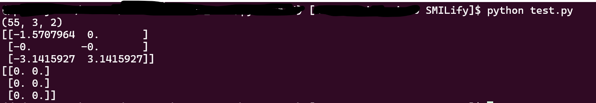

# Defining Joint Limits in Blender — User Guide

This guide shows, step by step, how to tell SMILify how far each joint of your model is allowed to rotate — e.g. "this knee bends between −30° and +45°". No coding needed: you author the limits in Blender, preview them in the viewport, export, and both fitting pipelines respect them automatically.

Technical details live in [issue56_implementation.md](design/issue56_implementation.md).

> 📷 **Screenshots.** All screenshots use the same worked example: the **SMIL_OmniAnt** model, bone **`w_1_l`**, with a Limit Rotation constraint of **X: −90°…0°, Z: locked (0°/0°), Y: free**, Owner = Local Space. Follow along with any model — only the numbers change. (Numbering skips 06/08/10; their content is covered by 07 and 09.)

---

## 1. Why joint limits?

When SMILify fits your model to images, it searches for a pose that matches. Without limits, it can find *impossible* poses — a leg bent backwards through the body. Joint limits fence off those poses: any joint that goes past its range gets penalised and is pulled back.

If you never set a limit on a joint, it stays "wide open" (free to rotate). You only need to author limits where anatomy demands them.

## 2. The one concept you must get right: axes and signs

Every joint can rotate around three axes — **X, Y, Z** — and each axis gets its own range `[Min, Max]`:

- **Min** = how far it can rotate in the *negative* direction (a negative number, e.g. −30°).
- **Max** = how far in the *positive* direction (e.g. +45°).
- `Min = Max = 0` means the axis is **locked** (no rotation at all).

**Which direction is "positive"?** That depends on the bone's own local axes — every bone carries its own little XYZ frame. Before typing numbers, always *look* at the bone's axes and *test-rotate* it (§4). Never guess the sign.

> ⚠️ **Caveat — very large ranges (beyond ±180°).** You author limits as Euler angles in Blender, but the fitter and the neural penalty compare them against the pose's **axis-angle** components. An axis-angle rotation has a canonical magnitude of at most 180° (|θ| ≤ π): a rotation "authored" as 270° about an axis is the same physical rotation as −90° about it, so per-axis bounds beyond ±180° are mathematically non-unique and the optimiser/network will happily satisfy them via the equivalent smaller rotation. In practice: keep each `[Min, Max]` within **−180°…+180°** per axis; ranges at exactly ±180° are fine (they mean "free"). This is a representation caveat, not a bug — nothing is clamped incorrectly at ±180°.


> 📷 **SCREENSHOT 01**: Pose Mode on the ant model, bone `w_1_l` selected (highlighted teal, right of the body). Per-bone axes are displayed: each bone carries small labelled axis lines (you can read the `X` and `Z` letters at the bone tails). The panel on the right is the armature's **Object Data Properties → Viewport Display**, with **Axes** ticked — that checkbox is what draws them.

To display bone axes: select the armature → **Object Data Properties** (green stick-figure tab) → **Viewport Display** → tick **Axes**.


> 📷 **SCREENSHOT 02**: The same scene with the **Viewport Display** panel expanded in the Properties editor: **Show → Axes** and **In Front** are both ticked (In Front keeps the axes readable through the mesh). With these on, the axis labels appear on every bone as in the viewport on the left.

## 3. Setup (once)

1. Build and install the add-on:

   ```bash
   cd 3D_model_prep
   python build_addon.py
   ```

   In Blender: **Edit → Preferences → Add-ons → Install…**, pick `smil_importer.zip`, enable it.
2. Open your rigged model (or import a `.pkl` model via the add-on), then **save the `.blend` file to a normal, writable folder**. An unsaved file makes the exporter fail with "Permission denied" (pitfall #1).


> 📷 **SCREENSHOT 03**: Preferences → Add-ons with the **SMIL Model Importer** entry expanded and its checkbox **ticked**. The ⚠ triangle next to the name is normal — it's the permanent "Requires scipy and scikit-learn" note, not an error. What matters is the **"All dependencies installed."** check mark under Preferences at the bottom; if you see an install button there instead, click it and restart Blender.


> 📷 **SCREENSHOT 04**: The ant model freshly imported (front view, armature overlaid in orange), with the sidebar (**N**) open on the **SMIL** tab. The panel shows the PKL filepath used for the import, the import options (shapekeys from PCA, Regress Joints, Symmetrise, …) and the **Direct Import SMIL Model** button. This is what your screen should look like before you start authoring limits.

## 4. Find the right axis and sign (the sign-posting step)

For the joint you want to limit:

1. Select the **armature**, switch to **Pose Mode** (top-left dropdown or `Ctrl+Tab`).
2. Click the bone.
3. Test-rotate it around one *local* axis at a time: press `R`, then the axis letter **twice** (e.g. `R` `X` `X` — pressing twice selects the bone's *local* axis, once gives the global axis, which is not what you want). Move the mouse and watch which way the limb swings.
4. Note the direction: the way it swings when you move toward *positive* angles is your **Max** direction; the opposite is **Min**. Press `Esc` to cancel the rotation without keeping it.
5. Repeat for `R Y Y` and `R Z Z` until you know what each axis does for this bone.


> 📷 **SCREENSHOT 05**: Bone `w_1_l` mid-rotation with `R` `X` `X` — the header at the top of the viewport reads **"Rotation: 37.78 along local X"**: that live readout, with its sign, is exactly the information you need to choose Min and Max. The red line through the bone marks the rotation axis. On the right, a Limit Rotation constraint has already been added but is still empty (all axes unticked, 0°) — at this stage it constrains nothing; §5 fills it in.

Tip: the angle readout in the viewport corner shows the current angle *with its sign* while you rotate — this tells you directly whether "knee bends forward" is positive or negative on that axis.

## 5. Author the limit

Still in Pose Mode with the bone selected:

1. Open the **Bone Constraint** tab in the Properties editor — the icon is a **bone with a wrench**. Check the panel header says **"Add Bone Constraint"**, *not* "Add Object Constraint" (that one is a different tab and the exporter never reads it — pitfall #2).
2. Click **Add Bone Constraint → Limit Rotation**.
3. For each axis you want to limit:
   - **Tick the axis checkbox** (Limit X / Limit Y / Limit Z). An unticked axis is ignored and exports as wide-open, even if you typed numbers into its fields (pitfall #3).
   - Enter **Min** and **Max** in **degrees** (e.g. Min = −90, Max = 0).
4. Leave axes you don't want to limit unticked.
5. To **lock** an axis completely, tick it and set Min = Max = 0.
6. Set **Owner = Local Space** (see below). The default is World Space, which the exporter (and the viewport preview) will *skip* with a warning.



> 📷 **SCREENSHOT 07**: The filled-in Limit Rotation constraint on `w_1_l`, showing all three authoring cases at once: **Limit X ticked with Min = −90°, Max = 0°** (a real range), **Y unticked** (stays wide open), and **Z ticked with Min = Max = 0°** (locked, step 5). At the bottom of the panel, **Owner** is already set to **Local Space** — the setting explained next.

### The "Owner" space setting (important)

At the bottom of the Limit Rotation panel there's an **Owner** dropdown. It's the coordinate space Blender measures the bone's rotation in before clamping it to your Min/Max:

- **World Space** (default) — measured against the global scene axes.
- **Pose Space** — relative to the armature's pose.
- **Local With Parent** — the bone's local frame, including its parent's rest orientation.
- **Local Space** — the bone's own local rest frame, ignoring the parent.
- **Custom Space** — relative to another object you pick.

**Set Owner = Local Space.** The exporter reads the raw Min/Max values and treats them as bone-local, then converts them into the model frame itself. Local Space is what makes "tick X, −90/0" mean "this bone rotates around *its own* X", which matches the test-rotate step in §4 (`R X X` uses the bone's local axis). Constraints left in any other Owner space are **skipped with a warning** at export — they will not land in the model at all.


Sanity check: with the constraint in place, test-rotate the bone again (`R X X`) — it should now visibly stop at your limits. If it stops in the wrong place, your sign is flipped: swap and negate (e.g. wrong `[0, 90]` → right `[-90, 0]`).

## 6. Visualize your authored limits (optional but recommended)

Before exporting you can preview every authored limit directly in the viewport: for each enabled axis of each bone's Limit Rotation constraint, a translucent wedge is drawn showing the allowed range (X = red, Y = green, Z = blue; the Y/twist wedge is an approximation by nature). The preview reads exactly the constraint fields the exporter reads, so what you see is what will land in `joint_limits`.

Two ways to enable it:

1. **Add-on panel (recommended):** in the SMIL panel, expand the **Visualization** sub-panel and tick **Show Joint Limit Overlay**. Untick to remove the overlay.
2. **Standalone script:** open `3D_model_prep/joint_rot_limit_vis.py` in Blender's Text Editor and press **Run**. Re-run to refresh after editing constraints; restart Blender to clear.


> 📷 **SCREENSHOT 09**: The overlay in action on `w_1_l`: a **red translucent wedge** fans out from the bone's head, sweeping exactly the authored −90°→0° range around its local X. The locked Z axis (0°/0°) draws no wedge — a zero-width range has nothing to show — and the free Y axis draws nothing either. In the SMIL panel the **Visualization** section is expanded with **Show Joint Limit Overlay** ticked, and the info line below it reminds you that only explicit Limit Rotation constraints are shown.


Caveats:

- Only explicit, enabled (non-muted), local-space **Limit Rotation** constraints are drawn — exactly the constraints the exporter reads, so preview and export agree.
- The IK-limit fallback and the wide-open default range are **not** visualised; a bone with no wedge simply has no explicit constraint.
- If a wedge points the wrong way, your sign is flipped — fix it now, before export (swap and negate, see §5).

## 7. Export

1. Select the **mesh object** (not the armature — pitfall #6).
2. In the SMIL panel, keep **Export Joint Limits** ticked (default), set the **Output Filename**, click **Export SMIL Model**.
3. Your limits are now stored inside the `.pkl` under the `joint_limits` key.


> 📷 **SCREENSHOT 11**: Ready to export: back in **Object Mode** with the **mesh** (`SMIL_OmniAnt`) selected — outlined orange, and active in the outliner. In the SMIL panel: **Export Joint Limits** ticked, **Default Joint Limit Range (rad) = 3.14**, Output Filename set to `SMIL_OmniAnt_authored.pkl`, and the **Export SMIL Model** button below. The red limit wedge is still visible in the viewport — the overlay doesn't interfere with exporting.

You do **not** need to worry about the bone's rest orientation: the exporter automatically converts your bone-local limits into the model's frame (for standard axis-aligned rigs the conversion is exact; a tilted, mixed-axis bone prints a warning and exports the numbers as-is).

## 8. Verify the export (optional but recommended)

```python
import numpy as np
from smal_model.smal_torch import load_smal_model   # chumpy-safe loader
dd = load_smal_model("your_model.pkl")
jl = np.asarray(dd["joint_limits"])
print(jl.shape)                          # -> (J, 3, 2)
i = dd["J_names"].index("your_bone_name")
print(jl[i])                             # your limits, in RADIANS
print(jl[0])                             # root -> all zeros
```

The `.pkl` stores **radians**: −90° appears as `-1.5708`, and unconstrained axes as `[-3.1416, 3.1416]`. That's expected, not a bug (pitfall #4).


> 📷 **SCREENSHOT 12**: The snippet run against the exported ant model. Output, top to bottom: the shape `(55, 3, 2)` (55 joints); then `w_1_l`'s three axis rows — `[-1.5707964, 0.]` (the authored −90°→0° range), `[-0., -0.]` (the locked axis), and `[-3.1415927, 3.1415927]` (the free axis, wide open); then the all-zero root row. Note the locked axis appears in the *middle* row even though Z was locked in Blender: the exporter has remapped the bone-local axes into the model's frame, which is exactly what the fitter needs.

## 9. Use the limits

- **Optimisation fitter:** point `config.SMAL_FILE` at your exported `.pkl` and run with the limit weight on (`w_limit > 0`). Nothing else to configure.
- **Neural training (optional):** add `"joint_limit_regularization": 1e-3` (start small) to the **`base_weights` dict inside `loss_curriculum`** in your JSON training config — the same nested path for both single-view and multi-view configs (see `smal_fitter/neuralSMIL/configs/examples/`):

  ```json
  {
    "mode": "singleview",
    "loss_curriculum": {
      "base_weights": {
        "joint_limit_regularization": 1e-3,
        "...": "other weights unchanged"
      }
    }
  }
  ```

  (For multi-view, only `"mode": "multiview"` differs. You can also raise/lower the weight per epoch via `loss_curriculum.curriculum_stages`; legacy multi-view configs that pass a flat `loss_weights` dict can put the key there instead.)

  Default is `0.0` = off. If the weight is anywhere > 0 in your curriculum and the model has no usable `joint_limits`, training stops at model construction with a clear error instead of silently ignoring it.


## Appendix: screenshot index

All screenshots (in `docs/design/images/`) follow one worked example: model **SMIL_OmniAnt**, bone **`w_1_l`**, Limit Rotation with **X: −90°…0°**, **Z: locked (0°/0°)**, **Y: free**, **Owner = Local Space**.

| # | Filename | Shows |
|---|----------|-------|
| 01 | `01_bone_local_axes.png` | Pose Mode, `w_1_l` selected, per-bone axis labels visible; Axes toggle ticked in Viewport Display |
| 02 | `02_enable_axes_display.png` | Viewport Display panel: **Axes** + **In Front** ticked |
| 03 | `03_addon_enabled.png` | Preferences → Add-ons: add-on enabled, "All dependencies installed." |
| 04 | `04_smil_panel_model_loaded.png` | Imported ant model + full SMIL panel in the sidebar |
| 05 | `05_test_rotate_local_axis.png` | `R X X` test-rotation, header reads "Rotation: 37.78 along local X"; empty constraint on the right |
| 07 | `07_limit_rotation_panel.png` | Filled constraint: X −90°/0°, Y free, Z locked; Owner = Local Space |
| 09 | `09_limit_overlay.png` | Red −90°→0° wedge on `w_1_l`; Visualization section with overlay ticked |
| 11 | `11_export_panel.png` | Object Mode, mesh selected; Export Joint Limits ticked; output `SMIL_OmniAnt_authored.pkl` |
| 12 | `12_pkl_verification.png` | Terminal: shape `(55, 3, 2)`, the bone's three rows (limited / locked / free), zero root |
